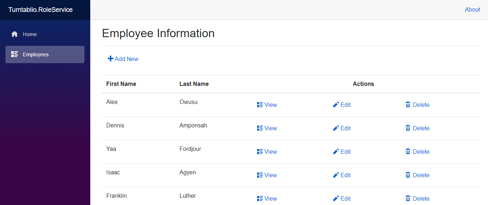
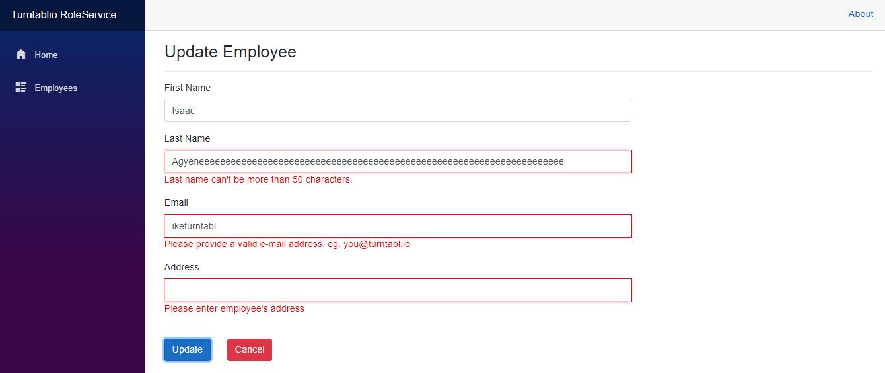
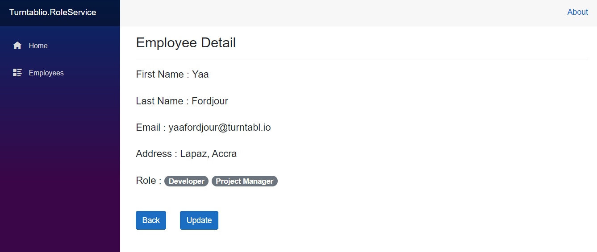
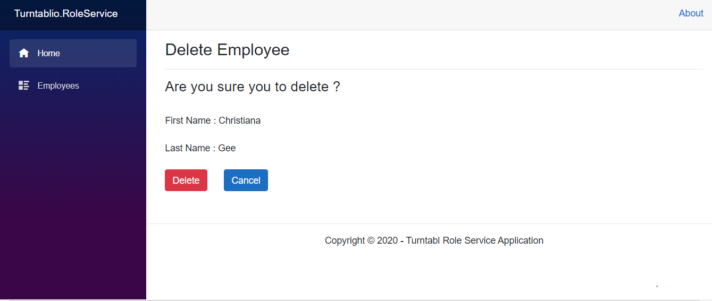
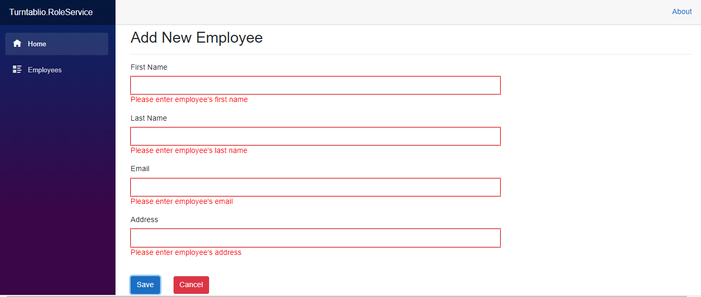

# Eployee Role Webapp
Turntabl Role Service using ASP.NET Core Blazor Server with .NET Framework 3.1

[Open](https://turnatabliorole.herokuapp.com/)

Get Employee List

Edit Employee with valid data

Employee Detail

Remove Employee

Add New Employee with validation

